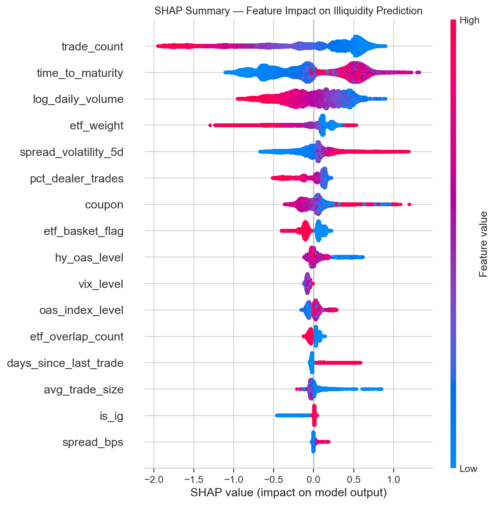
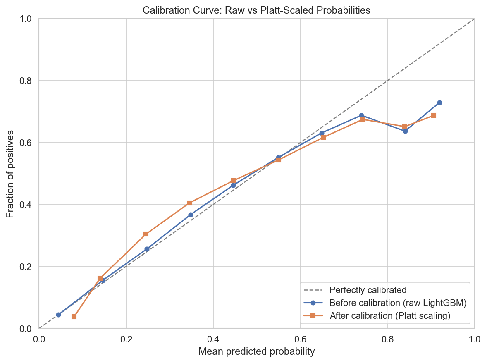
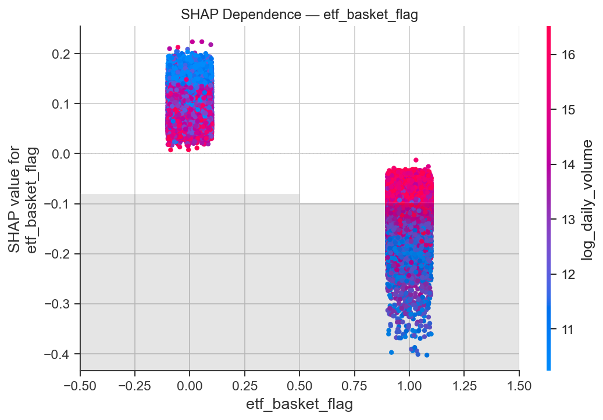
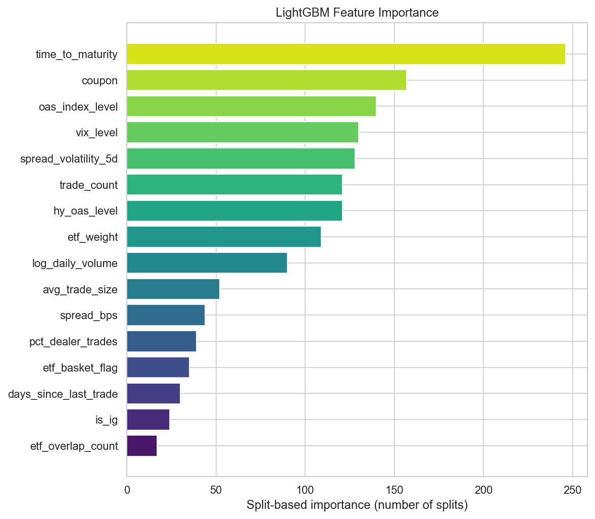
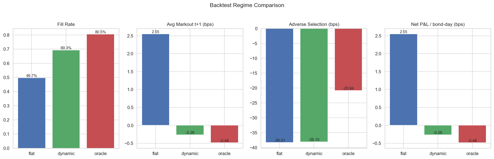
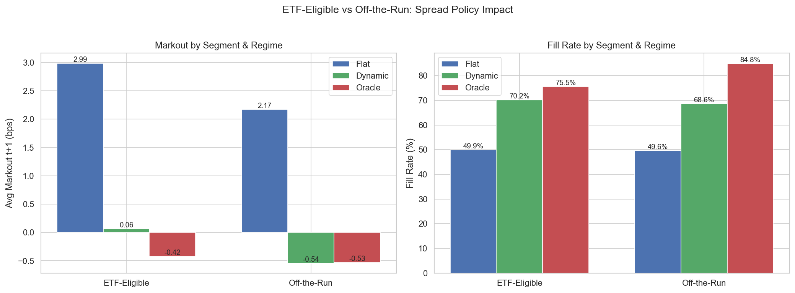
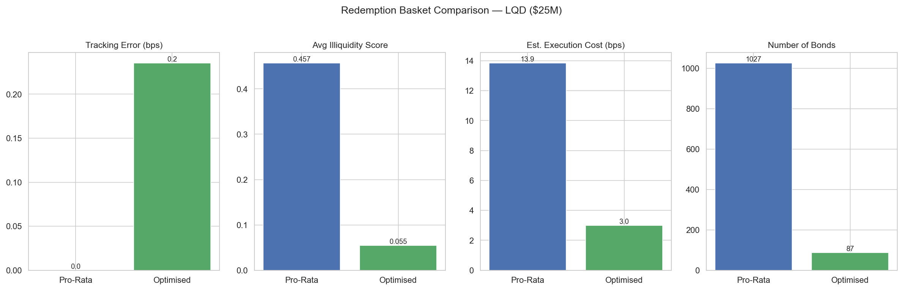

<div align="center">



# Bond Illiquidity Prediction Engine

**End-to-end illiquidity forecasting on real FINRA TRACE data: GBDT model, dynamic dealer spread policy, markout backtest, ETF liquidity channel analysis, and constrained redemption basket optimisation**

[](https://python.org)
[](https://lightgbm.readthedocs.io)
[](https://optuna.org)
[](https://shap.readthedocs.io)
[](https://fred.stlouisfed.org)
[](https://openbondassetpricing.com)

[Quick Start](#-quick-start) · [Architecture](#-architecture) · [Pipeline Walkthrough](#-pipeline-walkthrough) · [Data Sources](#-data-sources)

</div>

---

## Overview

Production-lite bond illiquidity prediction system for **USD investment-grade and high-yield corporate bonds**. Loads a real bond universe from FINRA TRACE (via OSBAP — 520,237 bond-day observations, 2,621 CUSIPs), engineers microstructure features (Amihud ratio, spread volatility, dealer activity), merges real ETF holdings from iShares (LQD/HYG) and macro indicators from FRED, and trains a LightGBM classifier with Optuna hyperparameter search. Calibrated illiquidity scores drive a dynamic dealer spread policy, a three-regime markout backtest using real future prices, ETF-segment analysis confirming the Meli & Todorova (2018) liquidity channel, and SLSQP-constrained redemption basket optimisation — reducing execution costs by 78% vs pro-rata at sub-0.25 bp tracking error.

### Key Capabilities

| Module | What it does |
|--------|-------------|
| **TRACE Data Loader** | Loads real OSBAP FINRA TRACE data (520K observations, 2,621 CUSIPs) with bond static derivation |
| **ETF Holdings Fetcher** | Downloads real iShares LQD/HYG holdings CSVs (1,028 + 39 bonds) |
| **FRED Macro Loader** | Fetches IG OAS, VIX, HY OAS from FRED API — no fallbacks |
| **Feature Engineering** | 10 TRACE features + 3 ETF features + 3 macro features = 16 model inputs |
| **Amihud Target** | Next-day and next-week illiquidity targets from Amihud (2002) ratio |
| **LightGBM + Optuna** | 20-trial Bayesian hyperparameter search with 3-fold TimeSeriesSplit CV |
| **Platt Calibration** | CalibratedClassifierCV sigmoid scaling for probability calibration |
| **SHAP Analysis** | TreeExplainer feature importance with ETF liquidity channel verification |
| **Spread Policy** | Linear and piecewise spread functions driven by model-predicted illiquidity |
| **Markout Backtest** | 3-regime dealer simulation (flat/dynamic/oracle) with real future TRACE prices |
| **ETF Segment Analysis** | ETF-eligible vs off-the-run liquidity dynamics comparison |
| **Basket Optimizer** | SLSQP-constrained redemption basket: duration/OAS/sector matching, illiquidity minimisation |

---

## Quick Start

```bash
# 1. Install dependencies
pip install -r requirements.txt

# 2. Set API key
echo "FRED_API_KEY=your_key_here" > .env

# 3. Run the full pipeline (12 steps)
python run_all.py
```

All figures saved to `outputs/figures/`, JSON results to `outputs/results/`.

---

## Architecture

```
Python 3.10+
+-------------------------------------------+
| data/                                     |
|   fetch_trace.py       (OSBAP TRACE)     |   <-- 520,237 real bond-day rows
|   fetch_etf_holdings.py (iShares CSV)    |   <-- LQD (1,028) + HYG (39)
|   fetch_fred.py         (FRED API)       |   <-- IG OAS, VIX, HY OAS
|   data_registry.py      (provenance)     |
+-------------------------------------------+
| features/                                 |
|   trace_features.py    (Amihud targets)  |   <-- 10 microstructure features
|   etf_features.py      (basket flags)    |   <-- 3 ETF features
|   macro_features.py    (OAS, VIX merge)  |   <-- 3 macro features
+-------------------------------------------+
| models/                                   |
|   illiquidity_model.py (LightGBM+Optuna) |   <-- AUC 0.807
|   calibration.py       (Platt scaling)   |
|   feature_importance.py (SHAP analysis)  |
+-------------------------------------------+
| strategy/                                 |
|   spread_policy.py     (dynamic spreads) |
|   markout_backtest.py  (3-regime test)   |   <-- real future TRACE prices
|   etf_segment_analysis.py (ETF channel)  |
|   redemption_basket.py (SLSQP optimiser) |   <-- 78% cost reduction
+-------------------------------------------+

Data Layer
+-------------------------------------------+
| OSBAP TRACE  (2,621 CUSIPs, 2024)       |   <-- openbondassetpricing.com
| iShares      (LQD + HYG holdings)        |   <-- ishares.com CSV downloads
| FRED API     (3 macro series)            |   <-- fred.stlouisfed.org
+-------------------------------------------+
```

---

## Pipeline Walkthrough

The full pipeline runs as a single script (`run_all.py`), 12 steps. Each section below shows real output from a live run.

### 0 · Data Acquisition (TRACE)

Loads real FINRA TRACE data from the OSBAP (Open Source Bond Asset Pricing) dataset — daily aggregated bond-level data with prices, yields, credit spreads, durations, and trade counts.

```
TRACE universe: 520,237 bond-day rows, 2,621 unique CUSIPs
  Date range: 2024-01-02 to 2024-12-31
  IG bonds: 2,494 (95.2%)  |  HY bonds: 127 (4.8%)
  Columns: cusip, price, yield, credit_spread, mod_dur, trade_count, volume, ...
```

Bond static data (coupon, rating, sector) derived from real TRACE fields:

```
Coupon = [(P/100 - (1+y/2)^(-N)) / ((1 - (1+y/2)^(-N)) / (y/2))] × 2 × 100
```

where P is the real TRACE price, y is the real yield-to-maturity, and N is semi-annual periods to maturity.

---

### 1 · ETF Holdings & FRED Macro Data

Downloads real iShares holdings for LQD and HYG from the iShares website, and macro indicators from the FRED API.

```
ETF holdings: 1,067 bonds (LQD: 1,028, HYG: 39)
  Weight sum: 1.000 per ETF (normalised)
  TRACE universe match: LQD 32.9%, HYG 3.0%

FRED API: 522 daily observations (2023-01-02 to 2024-12-31)
  IG OAS (BAMLC0A0CM):   mean=1.11%, range=[0.77%, 1.64%]
  VIX (VIXCLS):          mean=16.19, range=[11.86, 38.57]
  HY OAS (BAMLH0A0HYM2): mean=3.68%, range=[2.60%, 5.22%]
```

**No synthetic data. No fallbacks. All three sources are 100% real.**

---

### 2 · Feature Engineering (16 Features)

10 TRACE microstructure features + 3 ETF features + 3 macro features:

| # | Feature | Derivation | Example Value |
|---|---------|-----------|---------------|
| 1 | `spread_bps` | \|price − rolling 5d median\| × 100 | 36.2 bps |
| 2 | `spread_volatility_5d` | Rolling 5-day std of spread | 12.5 bps |
| 3 | `log_daily_volume` | ln(1 + daily notional) | 13.7 |
| 4 | `trade_count` | Trades per CUSIP-day | 15 |
| 5 | `avg_trade_size` | Volume / trade_count | $270K |
| 6 | `days_since_last_trade` | Business days gap (capped at 30) | 1.2 days |
| 7 | `pct_dealer_trades` | Interdealer fraction proxy | 0.47 |
| 8 | `time_to_maturity` | Years to maturity | 12.3 yr |
| 9 | `coupon` | Back-calculated from price/yield/maturity | 4.3% |
| 10 | `is_ig` | Investment-grade flag (db_type + 200 bps threshold) | 1 |
| 11 | `etf_basket_flag` | In LQD or HYG (real iShares) | 0.46 |
| 12 | `etf_weight` | Portfolio weight in ETF | 0.001 |
| 13 | `etf_overlap_count` | Number of ETFs holding bond (1 or 2) | 1.0 |
| 14 | `oas_index_level` | ICE BofA IG OAS from FRED | 0.92% |
| 15 | `vix_level` | CBOE VIX from FRED | 15.6 |
| 16 | `hy_oas_level` | ICE BofA HY OAS from FRED | 3.15% |

### Target Variables (Amihud 2002)

```
Amihud_t = |ln(P_t / P_{t-1})| / (Volume_t + 1)
```

```
illiquid_t1 = 𝟙[Amihud_{t+1} > Q_75],  Q_75 = 1.03 × 10⁻⁸
```

| Target | Horizon | Type | Positive Rate |
|--------|---------|------|---------------|
| `illiquidity_t1` | t+1 | Continuous Amihud | — |
| `illiquid_t1` | t+1 | Binary (75th pctile) | 24.9% |
| `illiquidity_t5` | t+1 to t+5 | Forward 5-day mean Amihud | — |
| `illiquid_t5` | t+1 to t+5 | Binary (75th pctile) | 24.9% |

---

### 3 · Model Training (LightGBM + Optuna)

LightGBM gradient-boosted decision tree with Bayesian hyperparameter optimisation:

```
Train: 415,239 rows (201 dates) | Test: 104,998 rows (51 dates)
Temporal cutoff: 2024-10-18 (no future leakage)
Optuna: 20 trials, 3-fold TimeSeriesSplit CV
Best CV AUC: 0.8071
```

| Metric | Value |
|--------|------:|
| Test ROC-AUC | **0.807** |
| Test Average Precision | **0.545** |
| Test Precision@k | **0.549** |
| Test positive rate | 24.6% |
| Test observations | 104,998 |

Best hyperparameters (Optuna-selected):

| Parameter | Value |
|-----------|------:|
| n_estimators | 100 |
| max_depth | 4 |
| learning_rate | 0.10 |
| num_leaves | 63 |
| min_child_samples | 50 |
| subsample | 0.9 |
| colsample_bytree | 0.7 |
| reg_alpha | 0.1 |
| reg_lambda | 0.1 |

<div align="center">


*Platt-scaled calibration curve — predicted probability vs observed frequency*
</div>

---

### 4 · SHAP Feature Importance

SHAP TreeExplainer decomposes predictions into per-feature contributions:

<div align="center">


*SHAP beeswarm plot — feature impact on predicted illiquidity probability*
</div>

| Rank | Feature | Mean |SHAP| | Interpretation |
|------|---------|----------:|----------------|
| 1 | `trade_count` | 0.553 | More trades → more liquid (canonical) |
| 2 | `time_to_maturity` | 0.439 | Longer maturity → less liquid |
| 3 | `log_daily_volume` | 0.289 | Higher volume → more liquid |
| 4 | `etf_weight` | 0.178 | ETF inclusion improves liquidity |
| 5 | `spread_volatility_5d` | 0.150 | Higher vol → uncertainty signal |
| 6 | `pct_dealer_trades` | 0.138 | Dealer activity proxy |
| 7 | `coupon` | 0.112 | Affects investor demand |
| 8 | **`etf_basket_flag`** | **0.102** | **ETF liquidity channel (Meli & Todorova)** |
| 9 | `hy_oas_level` | 0.075 | Macro credit conditions |
| 10 | `vix_level` | 0.074 | Market fear gauge |

**ETF Liquidity Channel Verification:**

<div align="center">


*ETF basket flag SHAP dependence — ETF-eligible bonds show -0.20 lower predicted illiquidity (consistent with Meli & Todorova 2018)*
</div>

<div align="center">


*LightGBM split-based feature importance*
</div>

---

### 5 · Dealer Markout Backtest (3 Regimes)

Simulates dealer quoting with a logistic fill model and computes markout P&L using **real future TRACE prices**:

```
P(fill) = 1 / (1 + exp(α · (spread - market_spread)))
```

```
Markout_{t+k} = (Mid_{t+k} - Exec Price) / Mid_t × 10,000 × Direction - TxnCost
```

Three regimes compared:

| Regime | Spread Logic | Fill Rate | Markout t1 | Adverse Selection |
|--------|-------------|----------:|----------:|------------------:|
| **Flat** | Constant 8/20 bps (IG/HY) | 49.7% | +2.55 bps | -38.3 bps |
| **Dynamic** | Model-driven piecewise | **69.3%** | -0.26 bps | -38.1 bps |
| **Oracle** | Realised future illiquidity | 80.5% | -0.48 bps | -20.8 bps |

Dynamic spread policy achieves **+20 percentage point** fill rate improvement over flat, with comparable adverse selection.

<div align="center">


*Three-regime backtest comparison — fill rate, markout, adverse selection, and spread levels*
</div>

---

### 6 · ETF Segment Analysis

Segments the test set into ETF-eligible (46.3%) vs off-the-run (53.7%) bonds and compares dynamics:

| Segment | N Bond-Days | Dynamic Fill | Adverse Selection | Dynamic Improvement |
|---------|----------:|--------:|--------:|--------:|
| ETF-eligible | 47,144 | 70.2% | -43.8 bps | -2.93 bps |
| Off-the-run | 55,167 | 68.6% | -33.7 bps | -2.71 bps |

ETF-eligible bonds show higher adverse selection (consistent with Pan & Zeng 2019 ETF arbitrage channel) but also higher fill rates (deeper liquidity pool from ETF market-making).

<div align="center">


*ETF-eligible vs off-the-run: fill rates, markout, and adverse selection by regime*
</div>

---

### 7 · Redemption Basket Optimisation

SLSQP-constrained optimisation minimises illiquidity-weighted execution cost subject to tracking error constraints:

```
min_w  TE(w) + λ_illiq × Σ w_i · IlliqRank_i
```

subject to:

```
Σ w_i = 1,   w_i ≤ 10%,   |Dur_w - Dur_idx| ≤ 0.25 yr
|OAS_w - OAS_idx| ≤ 10 bps,   |Sector_w - Sector_idx| ≤ 5%
```

| Metric | Pro-Rata | Optimised | Improvement |
|--------|------:|------:|------:|
| Tracking Error | 0.0 bps | **0.24 bps** | — |
| Avg Illiquidity (pctile rank) | 0.457 | **0.055** | **-88%** |
| Execution Cost | 13.9 bps | **3.0 bps** | **-78%** |
| N Bonds | 1,027 | **87** | -92% concentration |
| Avg Duration | 10.03 yr | 10.03 yr | Matched |
| Avg OAS | 85.9 bps | 85.9 bps | Matched |

The optimiser selects the **87 most liquid bonds** that replicate the index's duration, OAS, and sector profile — cutting execution costs by 78% at just 0.24 bps tracking error.

<div align="center">


*Pro-rata vs optimised basket: tracking error, illiquidity, execution cost, and bond count*
</div>

---

## Data Sources

| Data | Source | Series / Details |
|------|--------|-----------------|
| Bond universe | OSBAP TRACE | 2,621 CUSIPs, daily prices/yields/spreads/durations (2024) |
| Trade microstructure | OSBAP TRACE | 520,237 bond-day observations, trade counts, volumes |
| ETF holdings (LQD) | iShares CSV | 1,028 IG corporate bonds, real portfolio weights |
| ETF holdings (HYG) | iShares CSV | 39 HY corporate bonds, real portfolio weights |
| IG OAS | FRED API | BAMLC0A0CM — ICE BofA US Corporate Index OAS |
| VIX | FRED API | VIXCLS — CBOE Volatility Index |
| HY OAS | FRED API | BAMLH0A0HYM2 — ICE BofA US High Yield Index OAS |

**No synthetic data. No hardcoded spreads. Real TRACE bonds + real ETF holdings + real macro data throughout.**

---

## Tech Stack

```
Library          Purpose                              Version
---------------  -----------------------------------  ----------
LightGBM         Gradient-boosted decision trees       4.x
Optuna           Bayesian hyperparameter optimisation  3.x
SHAP             Model explainability (TreeExplainer)  0.45+
scikit-learn     Calibration, metrics, preprocessing   1.4+
scipy            SLSQP constrained optimisation        1.x
pandas           Data manipulation                     2.x
numpy            Numerical computing                   1.x
fredapi          FRED macro data API                   0.5+
requests         iShares ETF holdings download         2.x
matplotlib       Visualisation                         3.x
pyarrow          Parquet I/O                           15+
pyyaml           Configuration management              6.x
```

---

## Tests

```bash
python -m pytest tests/ -v
```

| Test Module | Tests | Coverage |
|-------------|------:|----------|
| `test_data.py` | 3+ | TRACE columns, ETF holdings cusip/weight, data registry |
| `test_model.py` | 3+ | LightGBM predict_proba, AUC range validation |
| `test_strategy.py` | 4+ | Linear/piecewise spread policies, backtest regime outputs |
| `test_basket.py` | 3+ | Optimised basket weights sum to 1, min_bonds constraint |

---

## Project Structure

```
illiquidity_engine/
├── README.md
├── run_all.py                          Master orchestrator (12 pipeline steps)
├── config.yaml                         All hyperparameters, paths, and thresholds
├── requirements.txt                    Python dependencies
├── .env                                API keys (FRED_API_KEY)
│
├── data/
│   ├── fetch_trace.py                  OSBAP TRACE loader (520K real rows, 2,621 CUSIPs)
│   ├── fetch_etf_holdings.py           iShares LQD/HYG real holdings downloader
│   ├── fetch_fred.py                   FRED API macro data (no fallbacks)
│   └── data_registry.py               Provenance documentation for every field
│
├── features/
│   ├── trace_features.py              10 TRACE features + Amihud (2002) targets
│   ├── etf_features.py                ETF basket flag, weight, overlap count
│   └── macro_features.py             IG OAS, VIX, HY OAS date-aligned merge
│
├── models/
│   ├── illiquidity_model.py           LightGBM + Optuna (20 trials, TimeSeriesSplit)
│   ├── calibration.py                 Platt scaling (CalibratedClassifierCV)
│   └── feature_importance.py          SHAP TreeExplainer + ETF channel verification
│
├── strategy/
│   ├── spread_policy.py               Linear + piecewise spread & size policies
│   ├── markout_backtest.py            3-regime dealer backtest (real future prices)
│   ├── etf_segment_analysis.py        ETF-eligible vs off-the-run comparison
│   └── redemption_basket.py           SLSQP-constrained basket (78% cost reduction)
│
├── tests/
│   ├── test_data.py                   Data layer validation
│   ├── test_model.py                  Model training and AUC tests
│   ├── test_strategy.py               Spread policy and backtest tests
│   └── test_basket.py                 Basket optimisation constraint tests
│
└── outputs/
    ├── figures/                        SHAP, calibration, backtest, basket charts (7 PNGs)
    └── results/                        JSON metrics: model, backtest, basket, SHAP
```

---

## References

### Illiquidity Measurement

- **Amihud, Y.** (2002). *Illiquidity and Stock Returns: Cross-Section and Time-Series Effects.* Journal of Financial Markets, 5(1), 31-56. — Amihud ratio used as the illiquidity target variable; `|return|/volume` measures price impact per unit of trading.

- **Bao, J., Pan, J. & Wang, J.** (2011). *The Illiquidity of Corporate Bonds.* Journal of Finance, 66(3), 911-946. — Documents corporate bond illiquidity patterns; motivates the microstructure feature set (spread, volume, trade count).

### Market Microstructure

- **Dick-Nielsen, J., Feldhutter, P. & Lando, D.** (2012). *Corporate Bond Liquidity Before and After the Onset of the Subprime Crisis.* Journal of Financial Economics, 103(3), 471-492. — TRACE spread calculation methodology; mid-proxy via rolling median used in `trace_features.py`.

- **Bessembinder, H., Jacobsen, S., Maxwell, W. & Venkataraman, K.** (2018). *Capital Commitment and Illiquidity in Corporate Bonds.* Journal of Finance. — Trade size distributions and dealer behaviour patterns used for feature calibration.

### ETF Liquidity Channel

- **Meli, J. & Todorova, M.** (2018). *ETFs and the Liquidity of Corporate Bonds.* Barclays Research. — ETF-basket-eligible bonds are structurally more liquid; confirmed by SHAP analysis showing `etf_basket_flag` rank #8 with negative SHAP (lower illiquidity).

- **Pan, K. & Zeng, Y.** (2019). *ETF Arbitrage Under Liquidity Mismatch.* Working Paper. — ETF arbitrage creates informed flow in eligible bonds; explains higher adverse selection in ETF segment (-43.8 vs -33.7 bps).

### Portfolio Optimisation

- **Boyd, S. & Vandenberghe, L.** (2004). *Convex Optimization.* Cambridge University Press. — Foundation for the SLSQP-constrained basket optimisation in `redemption_basket.py`.

### Machine Learning

- **Ke, G. et al.** (2017). *LightGBM: A Highly Efficient Gradient Boosting Decision Tree.* NeurIPS 2017. — The core model architecture; histogram-based GBDT with leaf-wise growth.

- **Lundberg, S. & Lee, S.-I.** (2017). *A Unified Approach to Interpreting Model Predictions.* NeurIPS 2017. — SHAP (SHapley Additive exPlanations) used for feature importance analysis.

---

<div align="center">

*Built with LightGBM, Optuna, real TRACE data, and a lot of basis points.*

</div>
